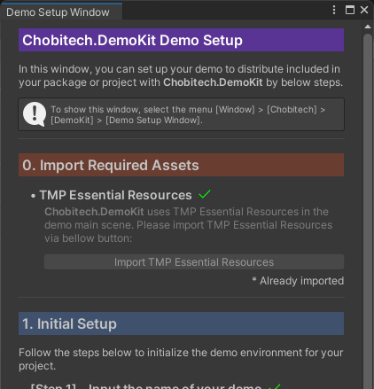
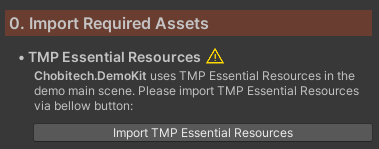
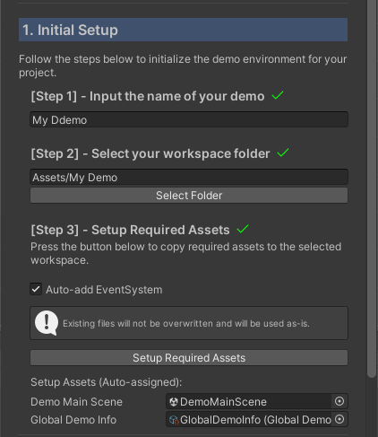
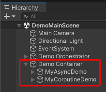
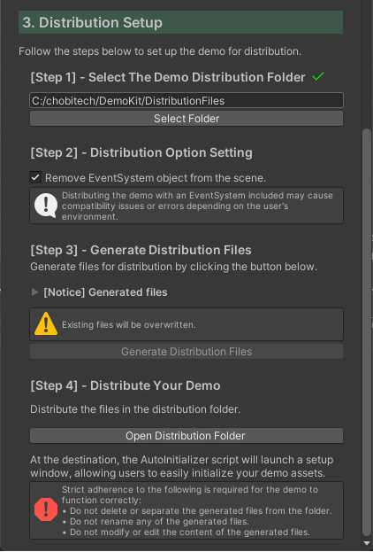

# Getting Started


[](https://github.com/chobitech/Chobitech_DemoKit)

---

This guide will help you set up **Chobitech.DemoKit** and create your first demo.

---

- [Getting Started](#getting-started)
  - [Prerequisites](#prerequisites)
  - [Installation](#installation)
    - [Installation](#installation-1)
      - [via Asset Store](#via-asset-store)
      - [via Unity Package](#via-unity-package)
  - [Running Demo with Chobitech.DemoKit](#running-demo-with-chobitechdemokit)
  - [Demo Creation Workflow](#demo-creation-workflow)
    - [Open the Demo Setup Window](#open-the-demo-setup-window)
    - [0. Import Required Assets](#0-import-required-assets)
    - [1. Initial Setup](#1-initial-setup)
    - [2. Implement Your Demo](#2-implement-your-demo)
    - [3. Distribution Setup](#3-distribution-setup)
  - [References](#references)


---

## Prerequisites
- **Unity 2022.3 or later**
- **TextMeshPro** (Essential Resources must be imported)

---

## Installation

### Installation

#### via Asset Store
- [**chobitech Asset Store page**](https://assetstore.unity.com/publishers/135416): Please add **Chobitech.DemoKit** to **My Assets** and import your project.

#### via Unity Package
1. Download the latest `.unitypackage` from [GitHub Release](https://github.com/chobitech/Chobitech_DemoKit/releases/latest).
2. Drag and drop the downloaded file into your Unity Project, or import it via the menu [Assets] > [Import Package] > [Custom Package] and select the `.unitypackage` file.

---

## Running Demo with Chobitech.DemoKit

<figure>

<figcaption>Callouts of DemoMainScene</figcaption>
</figure>

1. **Global Title**: Displays the name of the overall demo project.

2. **Global Description**: Provides a general overview and instructions for the entire demo toolkit.

3. **Individual Demo Info**: Shows the title and specific details of the currently selected individual demo. The side panel containing both Global and Individual descriptions can be toggled via the icon button in the top-left corner.

4. **Demo Controller**: Contains the dropdown for selecting demos and the Run/Stop toggle button.

5. **Log Console**: Displays real-time logs and execution status for the active demo. This panel can be toggled via the "Open/Close Log" button in the top-right corner.

---

## Demo Creation Workflow

### Open the Demo Setup Window

<figure>

<figcaption>Demo Setup Window</figcaption>
</figure>

In **Chobitech.DemoKit**, you can setup your demo with the setup wizard on the **Demo Setup Window**.
Show **Demo Setup Window** with following ways:

- **Dedicated Window**: [Window] > [Chobitech] > [DemoKit] > [Demo Setup Window]
  
- **Project Settings**: [Project Settings] > [Chobitech] > [DemoKit Setup]

---

### 0. Import Required Assets

<figure>

<figcaption>Import Required Assets Section</figcaption>
</figure>

After the setup window is displayed, see [Import Required Assets] section at first.

**Chobitech.DemoKit** requires **TMP Essential Resources** included in **TextMeshPro** to display texts on the demo main scene, so it needs to import **TMP Essential Resources**.

If you did not import the resources yet, press the "Import TMP Essential Resources" button in the setup window and import **TMP Essential Resources**.
Or, if you already imported the resources, skip this section.

> [!IMPORTANT]
> The setup wizard requires you to complete importing **TMP Essential Resources** before proceeding.

---

### 1. Initial Setup

<figure>

<figcaption>Initial Setup Section</figcaption>
</figure>

Next, initialize your demo in this section with the following three steps:

* **Step 1**: Input the name of your demo
    This name is set to **GlobalDemoInfo** asset described later.

* **Step 2**: Select the workspace folder
    The selected folder works as the workspace of your demo.

* **Step 3**: Setup Required Assets
    To copy the requires assets, **DemoMainScene** and **GlobalDemoInfo**, press the "Setup Requires Assets" button. When the button is pressed, the setup wizard copies the required assets to the workspace selected in Step 2.

    > [!NOTE]
    > **Required Assets**
    > * **DemoMainScene**: The main scene of your demo.
    > * **GlobalDemoInfo**: The `ScriptableObject` holds the global demo information.
    > 
    > In coping the assets, **GlobalDemoInfo** will be set to **DemoMainScene** automatically.

    > [!NOTE]
    > **"Auto-add EventSystem" Checkbox**
    > When checked, the setup wizard automatically adds a pre-configured `EventSystem` to your **DemoMainScene**. If you want to add a customized `EventSystem`, uncheck this.

    > [!IMPORTANT]
    > **Files in Workspace Folder**
    > When generating the distribution files in Distribution Setup section, the files in the workspace folder are only included. For more detail, see the "3. Distribution Setup" section.

---

### 2. Implement Your Demo

Open the **DemoMainScene** copied to your workspace and start implementing your demo.
**Chobitech.DemoKit** allows you to manage and switch between multiple demos within a single scene.

> [!CAUTION]
> **Protect System Objects**
> To ensure stability, **do not edit the preset objects** (e.g., **Orchestrator**, **Header**, **Footer**, etc.) within the **DemoMainScene**. These are essential for the DemoKit core logic.


Demo implementation workflow is below:

- **(A) Configure `IndividualDemoInfo`**
    `IndividualDemoInfo` is the information holder for your demo. By attaching an `IndividualDemoInfo` asset to your demo objects, the demo information will be automatically displayed in the **DemoMainScene** UI.

    > [!NOTE]
    > To generate a new `IndividualDemoInfo` asset, select the menu: [Assets] > [Create] > [Chobitech] > [DemoKit] > [Individual Demo Information].

- **(B) Inherit from `DemoBase` classes**
    To make your object a "Demo Entity", you must inherit from one of the following base classes depending on your preferred asynchronous style:

    - **`AsyncDemoBase`**: Use this for `async Task` based implementation.

    - **`CoroutineDemoBase`**: Use this for standard Unity `Coroutine` based implementation.

    <p></p>
 
    <details>
        <summary>📄 <b>Sample Code 1</b>: Implementing with <b>AsyncDemoBase</b></summary>

    ```csharp
    using System.Threading;
    using System.Threading.Tasks;
    using Chobitech.DemoKit;
    using UnityEngine;

    public class MyAsyncDemo : AsyncDemoBase
    {
        [SerializeField]
        private float durationSec = 2f;
        
        private Transform selfTransform;

        protected override void Awake()
        {
            base.Awake();

            // Caching the Transform of this object
            selfTransform = transform;
        }

        // Will execute when demo canceled.
        public override void OnDemoCanceled(CancellationToken token)
        {
            AddLogLnWithColorTag("error", $"{IndividualDemoInfo.name} canceled by {token}");
        }

        // Will execute when demo completed.
        public override void OnDemoCompleted()
        {
            AddLogLnWithColorTag("notice", $"{IndividualDemoInfo.name} finished.");
        }

        public override async Task DemoProcessAsync(CancellationToken token)
        {
            // Display the start log with "notice" color tag.
            AddLogLnWithColorTag("notice", $"Start {IndividualDemoInfo.name}");

            // Check if cancel is requested.
            token.ThrowIfCancellationRequested();


            /*
                Horizontal moving
            */

            var initPos = selfTransform.localPosition;

            var elapsedSec = 0f;
            while (elapsedSec < durationSec)
            {
                token.ThrowIfCancellationRequested();

                var x = 2 * Mathf.Sin(2 * Mathf.PI * elapsedSec / durationSec);
                var pos = new Vector3(initPos.x + x, initPos.y, initPos.z);
                selfTransform.localPosition = pos;

                // Display the x of current position on the log area
                AddLogLn($"x = {x}");

                elapsedSec += Time.deltaTime;

                token.ThrowIfCancellationRequested();

                await Task.Yield();
            }

            // Reset position
            selfTransform.localPosition = initPos;

            token.ThrowIfCancellationRequested();
        }
    }
    ```

    </details>

    <p></p>

    <details>
        <summary>📄 <b>Sample Code 2</b>: Implementing with <b>CoroutineDemoBase</b></summary>

    ```csharp
    using System.Collections;
    using Chobitech.DemoKit;
    using UnityEngine;

    public class MyCoroutineDemo : CoroutineDemoBase
    {
        private Transform selfTransform;

        [SerializeField]
        private float durationSec = 2f;

        protected override void Awake()
        {
            base.Awake();

            // Caching the Transform of this object
            selfTransform = transform;
        }

        // Execute on demo canceled.
        public override void OnDemoCanceled()
        {
            AddLogLnWithColorTag("error", $"{IndividualDemoInfo.name} is canceled.");
        }

        // Execute on demo completed.
        public override void OnDemoCompleted()
        {
            AddLogLnWithColorTag("warning", $"{IndividualDemoInfo.name} finished.");
        }

        public override IEnumerator DemoRoutine()
        {
            // Display the start log with "notice" color tag.
            AddLogLnWithColorTag("warning", $"Start {IndividualDemoInfo.name}");

            /*
                Vertical move
            */

            var initPos = selfTransform.localPosition;
            
            var elapsedSec = 0f;
            while (elapsedSec < durationSec)
            {
                var y = 2 * Mathf.Sin(2 * Mathf.PI * elapsedSec / durationSec);
                var pos = new Vector3(initPos.x, initPos.y + y, initPos.z);

                selfTransform.localPosition = pos;

                // Display the y of current position on the log area
                AddLogLn($"y = {y}");

                elapsedSec += Time.deltaTime;

                yield return null;
            }

            // Reset position
            selfTransform.localPosition = initPos;
        }
    }
    ```

    </details>

    <p></p>

    > [!TIP]
    > **Lifecycle Hooks**
    > You can override `OnDemoCompleted()` to trigger success actions, or `OnDemoCanceled()` to handle cleanup when a demo is stopped by the user in each `DemoBase` inherited class.

- **(C) Register with Demo Container**

    <figure>
    
    <figcaption>Demo Objects in Demo Container</figcaption>
    </figure>

    Place your created demo objects under the **Demo Container** GameObject in the **DemoMainScene**. The system automatically detects and manages objects registered here.


Repeat the above steps (A) through (C) for each demo you want to implement.

> [!IMPORTANT]
> **Store All Assets in the Workspace Folder**
> To ensure your demo functions correctly after distribution, all related assets—including the **DemoMainScene**, **GlobalDemoInfo**, and any custom scripts or models—must be stored within the designated **Your Workspace Folder**.

---

### 3. Distribution Setup

<figure>
    
    <figcaption>Distribution Setup Section</figcaption>
    </figure>

Now, you can generate the files for distribution your demo to users with the following steps:

* **Step 1**: Select the distribution folder
    The distribution files will be generated in the selected folder.

* **Step 2**: Check the distribution option settings
    When the option "Remove EventSystem object from the scene" is checked, the system will remove automatically the GameObject attached `EventSystem` from the **DemoMainScene** in generating the distribution files.

    > [!IMPORTANT]
    > If the **DemoMainScene** includes the `EventSystem` GameObject, it may be caused compatibility issue or errors depending on user's environment.

* **Step 3**: Generate Distribution Files
    Press the "Generate Distribution Files" button and generate the distribution files.
    The distribution files will be generated in the distribution folder selected at Step 1.
    The generated files are:
    - **DemoAutoInitialized.cs**: A C# script initializes your demo in the distribution destination.
    - **DemoAssets.zip**: A zip archive contains the files in the workspace folder.
    - **DemoKit_Internal.unitypackage**: A Unity package file contains the code **Chobitech.DemoKit** components.
  
    > [!NOTE]
    > The following files and folders are **NOT CONTAINED** in **DemoAsset.zip**:
    >    - The system files generated by OS (e.g., Thumbs.db, .DS_Store, etc.)
    >    - Starting with dot (.)


* **Step 4**: Distribute Your Demo
    Finally, distribute all the generated files **as they are** to the destination you want to.

    > [!CAUTION]
    > **Do not modify or rename the output files**
    > To ensure the demo functions correctly in the destination environment:
    >   * **Do not delete or separate** the generated files from the folder.
    >   * **Do not rename** any of the generated files.
    >   * **Do not modify** or edit the content of the generated files.

---


## References
* [API Reference](api/Chobitech.DemoKit.html)

---

* [Return to Home](./)

---

© 2026 chobitech. Licensed under the MIT License.
