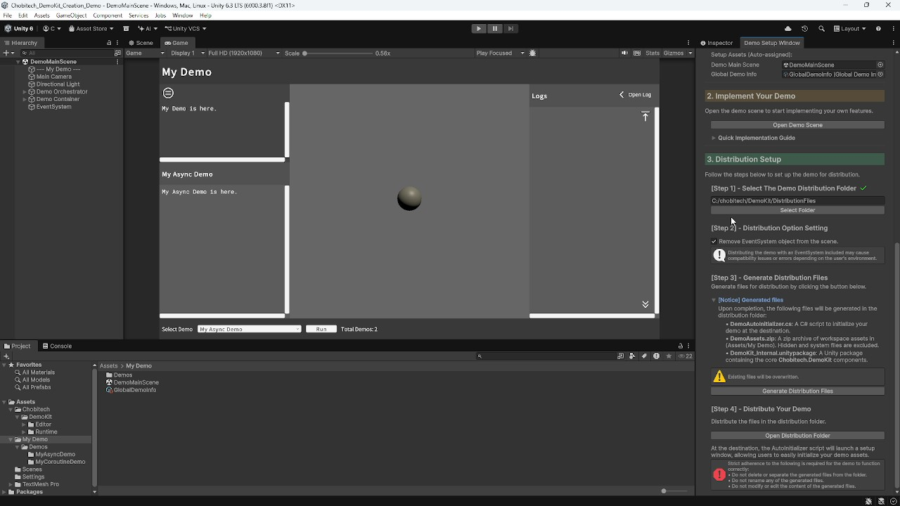

# Chobitech.DemoKit

---

**Chobitech.DemoKit** simplifies your demo creation workflow through intuitive wizards and ready-to-use tools.

---

<figure>

</figure>

---

## Key Features

* **One-Stop Wizard**: A comprehensive wizard that handles everything from demo initialization to distribution file generation.
* **Dual Workflow Support**: Seamlessly manage both **Asynchronous (Task-based)** and **Coroutine-based** demonstration logic with ease.
* **Ready-to-Use UI**: Includes a polished header, footer, description area, and a rich-text supported logging system for immediate use.
* **Smart Execution Management**: Built-in support for CancellationToken and lifecycle hooks such as `OnDemoCompleted` and `OnDemoCanceled`.
* **Clean Architecture**: Efficiently manage multiple demo cases within a single main scene, keeping your project organized and clutter-free.

---

## Installation

#### via Asset Store
- [**chobitech Asset Store page**](https://assetstore.unity.com/publishers/135416): Please add **Chobitech.DemoKit** to **My Assets** and import your project.

#### via Unity Package
1. Download the latest `.unitypackage` from [GitHub Release](https://github.com/chobitech/Chobitech_DemoKit/releases/latest).
2. Drag and drop the downloaded file into your Unity Project, or import it via the menu [Assets] > [Import Package] > [Custom Package] and select the `.unitypackage` file.

---

## Getting Started

- Follow our [Getting Started guide](getting-started.md) to build your demo.
- Also, check the [API Reference](api/Chobitech.DemoKit.html) for advanced customization.

---

## Dependencies

- `Unity.TextMeshPro`

---

## Change Log

- [CHANGELOG](CHANGELOG.html)

---

## Licenses

- **Chobitech.DemoKit** is licensed under the [MIT License](LICENSE.html).

---
© 2026 chobitech. Licensed under the MIT License.
